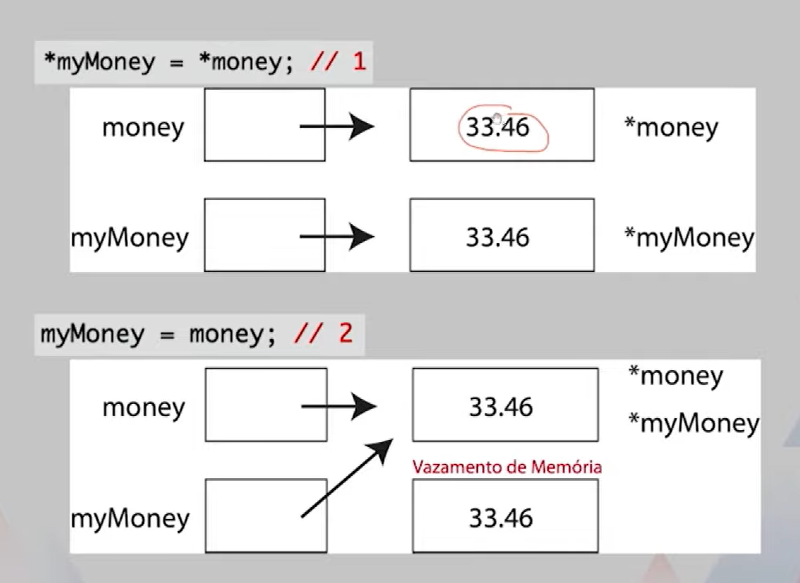
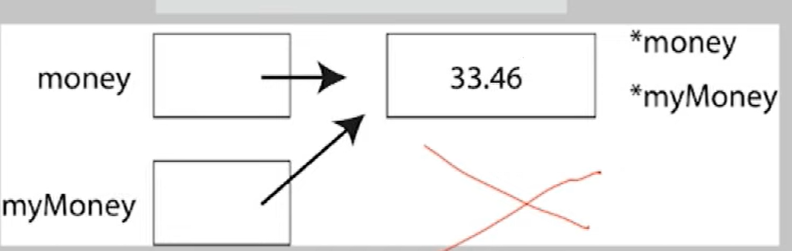

# Ponteiros e Referências

## declarar uma variavel poniteiro 
```
int* intPointer
```
Como a variavel acima não foi inicializada, o seu conteúdo será unfefined.

## Como obter um endereço de memória?

### Estática

> [!NOTE]
> Aloca a memoria em tempo de compilação

#### Inicialização de Ponteiros

O operador & nos permite obter o endereço de memória de uma variável. Feito isso, 
podemos inicializar um ponteiro.

```
int alpha;
int* intPointer;

//inicializando ponteiro
intPointer = &alpha;
```
O *intPointer* passa a apontar para uma região de memoria que está o valor da variavel *alpha*.


### Dinâmica
> [!NOTE]
> Aloca a memoria em tempo de execução

#### Inicialização de Ponteiros
Uma segunda maneira de inicializar ponteiros é com alocação dinãmica, um macanismo pela qual um programa aloca e libera memória em tempo de execução

- Vantagens
    - Elimina a necessidade de definir a priori o tamanho da memória a ser utilizada.
    - É possível aumentar ou ddiminuir o tamanho dad memória utilizada em tempo de execução.

- Os operadores ***new*** e ***delete*** são utilizados para efetuar a alocaçõa e desalocação de memória, respectivamente. 

- Alocando memória dinamicamente para armazenar um inteiro.
    - ```
        int *intPointer;
        intPointer = new int;
      ```
    - Características da alocação dinâmica
        - As variáveis residem em um local diferente das que foram alocadas estaticamente.
        - uma varíavel alocada de foma dinâmica com ***new*** não possui nome.
        - Essa varíval precisa ser acessada indiretamente pelo ponteiro retornado por ***new***.
## Utitlização da Memória

- Temos um ponteiro e queremos acessar o valor que está na memória. Nesse caso, usamos o operador* como um prefixo para o nome da variável.
- O operador* é um operador unário que retorna o conteúdo da variável localizada no endereço especificado. 
- para obter o conteúdo que está localizado no endereço apontado por intPointer: 
    
    ```
    //o valor que está apontado para intPointer, agora é alocado em anotherInt.
    int anotherInt;
    anotherInt = *intPointer;
    ```
- Para alterar o conteúdo que está localizado no endereço apontado por intPointer:
    ```
    *intPointer = 25;
    ```
- Um ponteiro com valor 0 (zero), por definição, aponta para o vazio, mas não queremos confundir com o interio zero. Nesse caso, usaremos a contante ***NULL** que está no pocote ***cstddef***.
    ```
    #include <cstddef>
    bool* truth = NULL;
    float* money = NULL;
    ``` 
### Memoria após algumas operações
```
bool* truth = new bool;
*truth = true;

float* money = new float;
*money = 33.46;

float* myMoney = new float;
```


- Qualquer operação que pode ser aplicada a uma variavel do tipo ***int*** pode ser aplicada a _*intPonter_
    exemplo:
    ```
    novoInt = *intPointer + 1;
    ```
- Qualquer operação que pode ser aplicada a uma veriável do tipo ***float*** pode ser aplicada a _*money_.
- Qualquer operação que pode ser aplicada a uma veriável do tipo ***bool*** pode ser aplicada a _*truth_.

##Cuiados com Ponteiros
> [!IMPORTANT]
> As duas operações a seguir são completamente diferentes.
- Na primeira, o conteúdo de mamória apontado por money é copiado para a região apontada or myMoney.
- Na sefunda, myMoney passa a apontar para a mesma região apontada por money.
```
*myMoney = *money; // 1
myMoney = money; // 2
``` 


- Supondo que a segunda operação fosse a sua intensã, evite o vazamento de memória com o ***delete***.
```
delete myMoney;
myMoney = money;
```
