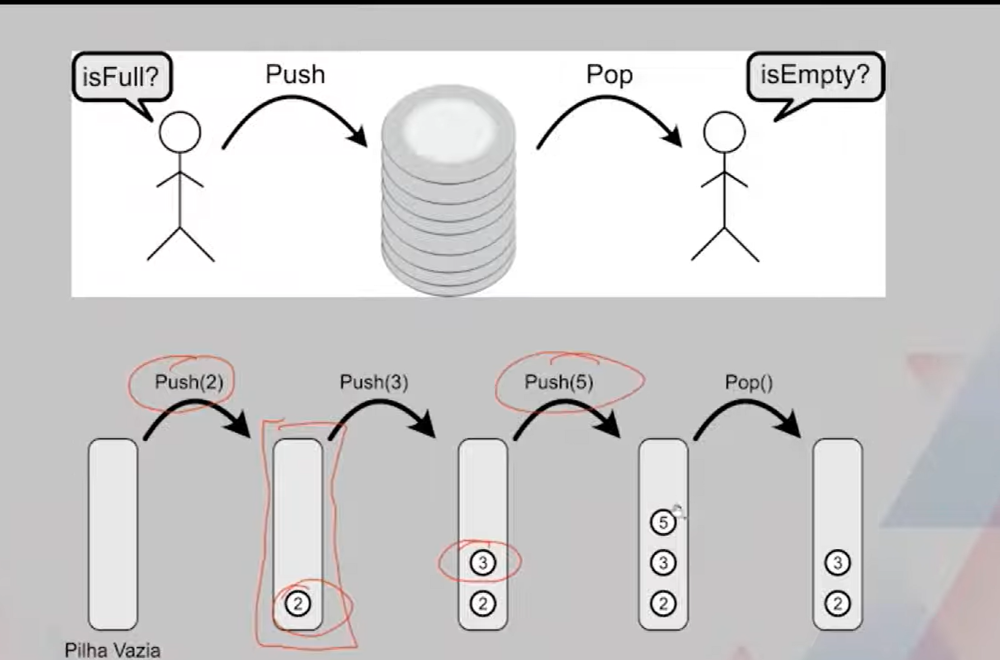
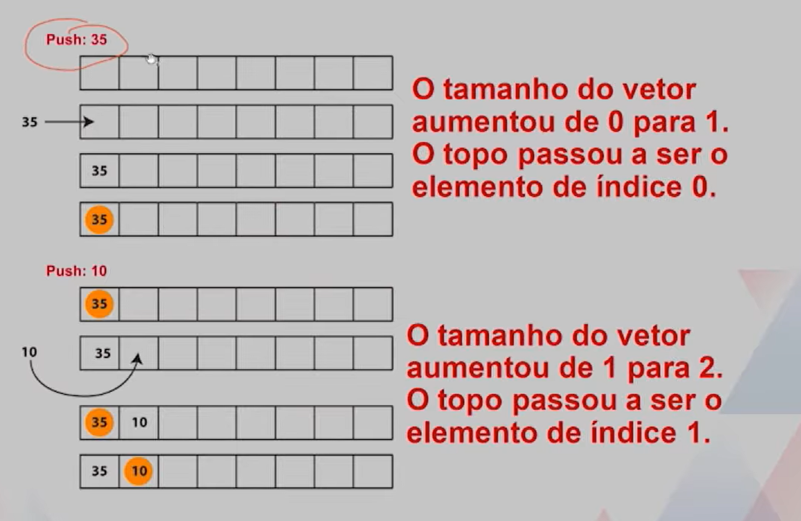
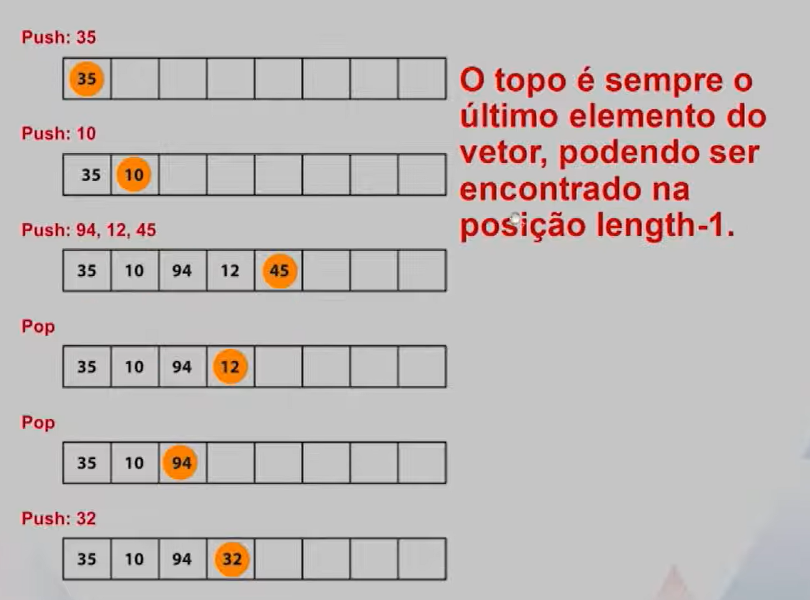

# Estrutura de dados - pilhas



Uma **pilha** ´euma estrutura bastante útil, principalmente quando precisamos garantir alinhamento de componentes em processos. 
-   chamada de funções na execução de programas.
-   Análise de sintaxe de linguagens de programação
-   verificação de alinhamento de parênteses em string


## Detalhes da Implementação

A posição do topo da pilha dependen do número de elementos que estão na pilha.

Queremos que a inserções re remoções ocorram em tempo contante. em outras palavras, independem do número de elementos na estrutura.




Implementando essa ideia, temos:

-   Construtor e Destrutor

```
Stack::Stack()
{
    length = 0;
    structure = new ItemType[MAX_ITEMS];
}

Stack::~Stack()
{
    delete [] structure;
}
```