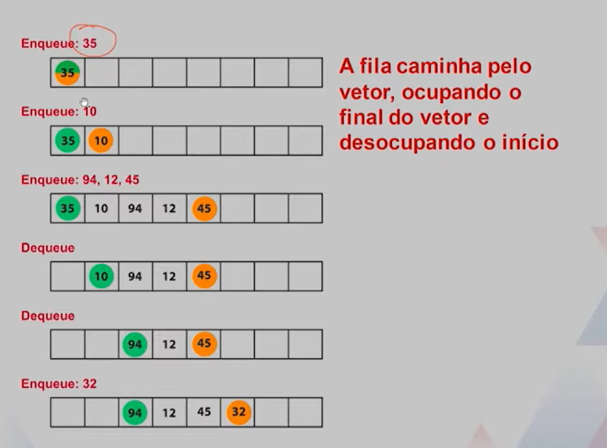
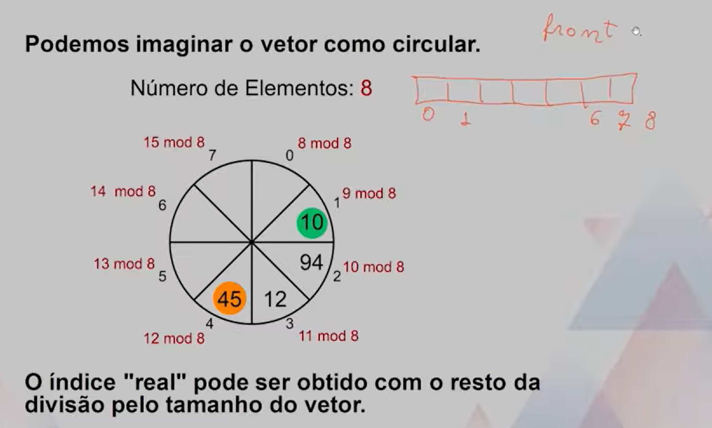

# Estrutura de dados - Fila

## Aplicação 
Uma **FILA** é uma estrutura bastante útil, principalmente quadno precisamos garantir que processos acessarão recursos compartilhados de uma maneira justa.
-   Documentos eviados para a impressão.
-   Troca de mensagens entre processos em um Sistema Operacional.

## Detalhes de Implementação
Implementaremos uma fila como vetor.

A posição do elemento na frente da fila será indicada por uma variável inteira. 
```
int front
```

A posição do elemento atrás da fila será indicada por uma segunda variável inteira. 
```
int back
```

Queremos que inserções e remoções ocorram em tempo constante.

## Imagens da aula
Verde indica o primeiro inteiro da fila, enquanto laranja indica o ultimo


Sempre que faço uma operação de enfileirar(enqueue) os valores vão para o final da fila. E em uma operação de desenfileirar(dequeue), retiro o primeiro valor da fila

## Vetor circular


