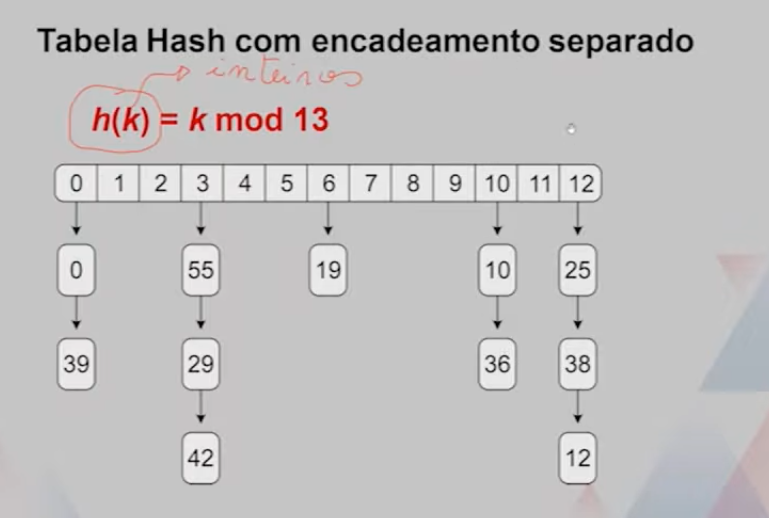
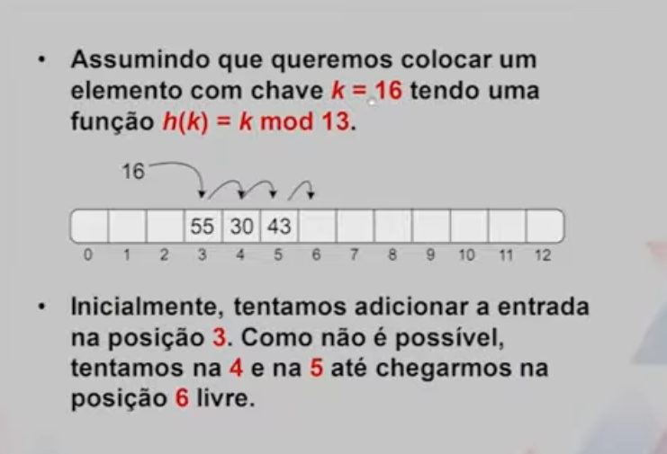

# Tratamento de colisões

A presença de colisões, quando duas chaves **k1** e **k2** geram h(k1) = h(h2), impede que faça imediatamente a inserção de um novo item (k,v) diretamente em A[h(k)] no arranjo A.

Para resolver as colisões, pode utilizar tanto um espaço de memória adicional quanto um espaço no próprio arranjo. 

## Encadeamento Separado

Uma ideia simples para tratar colisões é fazer com que cada endereço A[i] seja, na verdade, um ponteiro para uma lista encadeada. 

Uma boa função de hash fará com que a maior parte dos endereços esteja vazio ou com apenas um elemento. 

-   Ao colocar n elementos em N endereços, espera-se n/N entradas por endereço.
-   O valor n/N (Também chamado fator de carga) deveria ser limitado por uma constante, idealmente menor que 1.
-   Implementam-se as operações **insertItem, deleteItem, retrieveItem** para executarem em um tempo esperado constante. 

## Tabela Hash com encadeamento separado

Esse array tem 13 elementos, com indice de 0 a 12. quando inserir um valor, o indice que ele for calculado, vai iniciar um ponteiro para uma lista, onde todos os valores dessa lista vai constar nesse mesmo indice, ou seja, todos os elementos que colidiram. 

## Teste linear
As colisões serão tratadas em alocação de memória adicional, usaremos o próprio arranjo. 

Se tentarmos inserir um item **(k,v)** em um endereço **A[i]** ocupado, com **i = h(k)**, tenta-se de novo no endereço **A[(i+1) mod N]**.

As tentativas continuam até se encontrar um endereço que aceite o novo item. 

-   As operações **retrieveItem** e **deleteItem** devem também ser atualizadas.
-   Por exemplo, **retrieveitem** deverá examinar endereços consecutivos, iniciando em ** A[h(k)], até encontrar a chave igual a **k**.
-   Se **k** não existir, então a **retrieveItem** finalizará em uma possição vazia. 
-   O nome "teste Linear" ocorre porque acesaar **A[h(k)]** implica em testar a chave para verificar se encontramos a entrada desejada. 
-   As operações **deleteItem** não poderão mais remover os itens, pois isso fariam com que alguma chave não pudesse mais ser achada pelo **retrieveItem**
-   Por exemplo, **retrieveItem** não mais achará a chave **16** se remover **55, 30, 43**
-   A solução será fazer co que o **deleteItem** naõ remova o elemento, mas substitua por um marcador "disponível".
-   Nesse caso, as buscas pela chave **k** podem pular pelos endereços "disponíveis" e continuar até encontrar a chave ou uma célula vazia. 
-   A operação **insertItem** pode usar os endereços "diponíveis" para inserir entradas. 