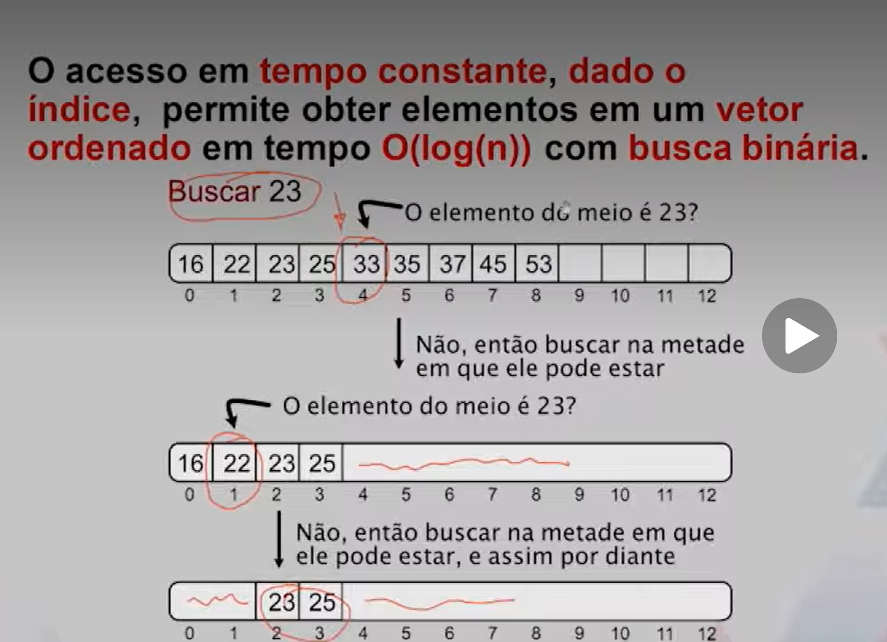

# Organização dos Dados na Memória (contíguo ou disperso)

## Listas linear não encadeada. 

A ordem logica é a mesma da ordem fisica

[Notebook](https://notebook.google.com/notebook/6e274c76-8a67-43d2-85b1-8def759f7a98)

Em **listas lineares sequenciais** a **ordem lógica** dos elementos (ondem "vista" pelo usuário) é a mesma da **ordem física. Isto é, elementos vizinhos na lista estão em posições vizinhas da memória.
Essa organização confere ecesso em tempo constante a qualquer elemento, dado o índice do elemento.

## listas linear encadeada

Lista linear em que a ordem lógica dos elementos **não** é a mesma da ordem física. Como é uma lista linear, cada elemento tem um **sucessor** e um **predecessor**. 

Os elementos estão espalhados na memória. 

Cada elemento precisa indicar em que endereço o seu sucessor pode ser encotrado de modo a manter a ordem lógica.

Como consequência, **a busca binária deixa de fazer sentido**, dado que nao acessamos o elemento do meio de um array em tempo constante. 
-   A busca por uma chave pode exigir a comparação com todos os elementos da estrutura, mesmo com o array ordenado. 

Entretanto, esta nova estrutura possui vantagens. 
-   Número de elementos pode aumentar ou diminuir durante a execução do programa.
-   A manutenção da ordem lógica não exigirá deslocamento de elementos.

## Pilhas com listas encadeadas 

como pilhas são estruturas lineares, podemos implementá-las com listas encadeadas. 

-   O primeiro elemento a entrar na estrutura tem que ser o ultimo a sair. O último elemento a entrar tem que ser o primeiro a sair. 
-   As inserções e remoções ocorrem na cabeça da pilha. 
-   Inserções e remoções devem ocorrer em tempo constante. Em outras palavras, independem do numero de elementos na estrutura.

## Filas com listas encadeadas

Como filas são estruturas lineares, podemos implementá-las com olistas encadeadas.

-   Estrutura de dados em que o primeiro elemento a entrar é o primeiro elemento a sair. 
-   Se pedro envio um documento para a impressora antes de Pedro, então o documento de pedro será impresso antes
doc documento de Paulo. 
-   Inserções e remoções devem ocorrer em tempo contante. Em outras palavras, independem do número de elementos na estrutura. 