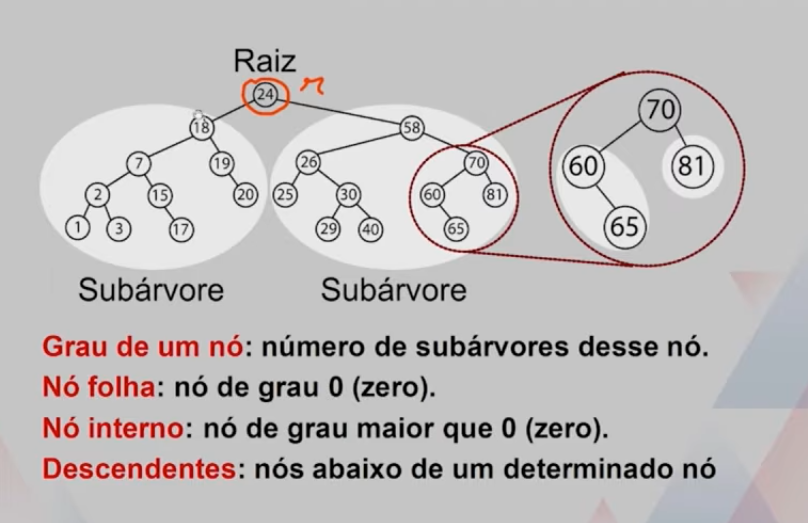
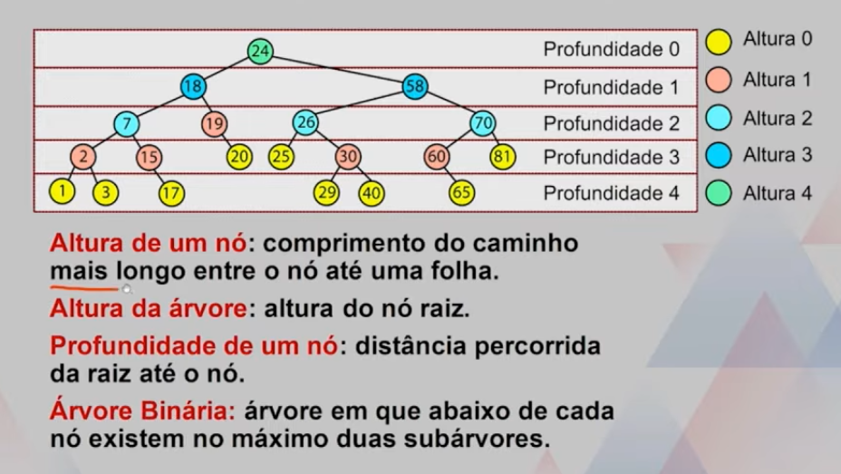
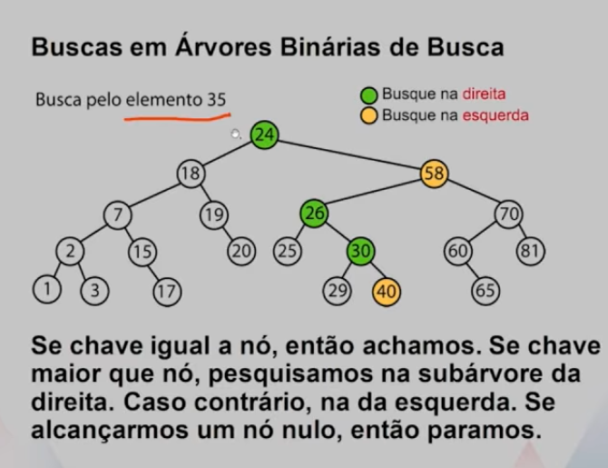
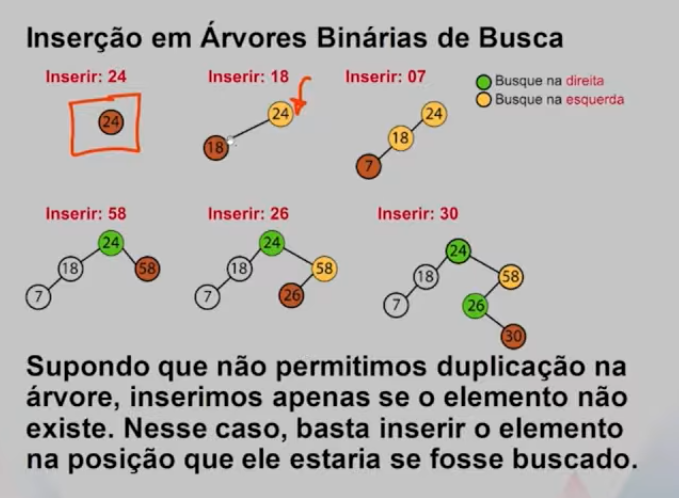
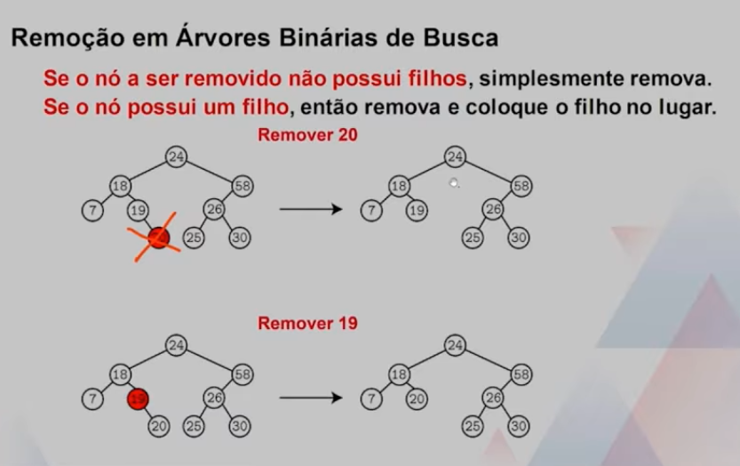
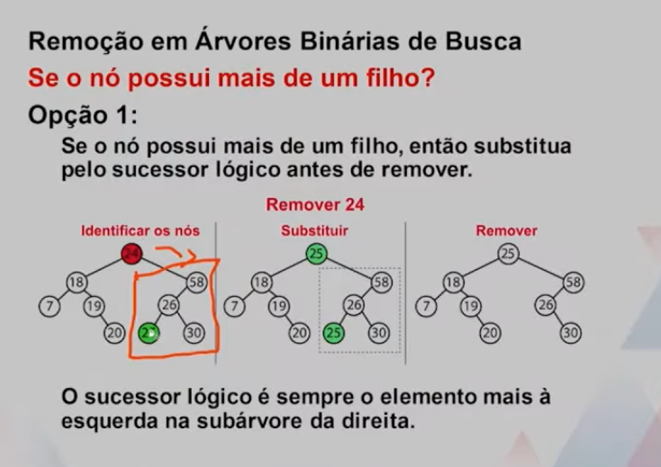
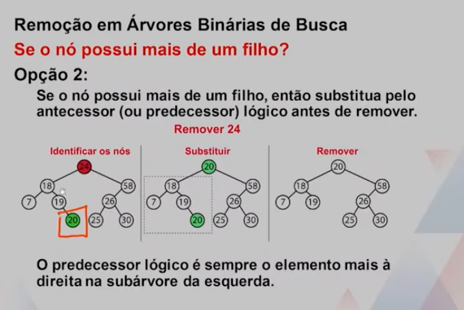
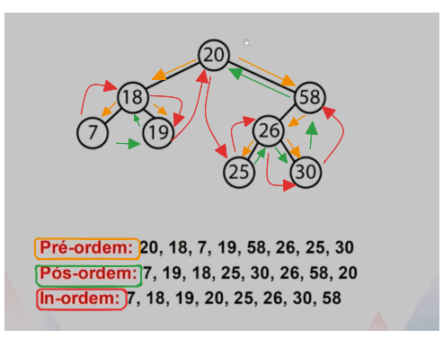

# Conceitos

Uma árvore é um conjunto de nós em que existe um nó raiz (r), que contém zero ou mais subárvores cujas raízes são ligadas diretamente a r. As subárvores também são árvores, ou seja, essa é uma definição recursiva. 

Uma árvore não é uma estrutura linear, não há no máximo um sucessor por nó.
*   São adequadas para representar hierarquia os dados. Ou seja, eu posso ter mais de um sucessor para cada nó. ,

os nós [1, 3, 17, 29, 40, 65], são chamados de nó folha. 

Altura e profundidade de uma árvore binária. 

## Árvore binária de busca
Árvore binária de busca em que, a cada nó, todos os registros com chaves menores que a deste nó estão na subárvore da esquerda, enquanto que os registros com chaces maiores estão na subárvore da direita. 

inserções, remoções e buscas possuem número de comparações proporcional à altura da árvore. 

### Busca

### Inserção

### Remoção

## Percursos

Em muitos algoritmos, precisamos percorrer os nós de maneira sistemática, visitando cada nó apenas uma vez. 

Existem três tipos de percursos mais comuns em árvores binárias:
-   Pré-ordem
-   Pós-ordem
-   In-ordem

A diferença entre os caminhamentos se refere ao momento em que visitamos o nó central. 

*   Sempre visitamos a subárvore da esquerda antes de visitaarmos a suvárvore da direita. 
*   **Pré-ordem**: visitamos, a partir da raiz, primeiramente o nó raiz, depois os nós da esquerda, e depois os nós da direita. 
*   **Pós-ordem**: visitamos, a partir da raiz, primeiramente o nó da esquerda, depois os nós da direita e depois concluímos visitando o nó raiz. 
*   **In-ordem**: visitamos, a partir da raiz, primeiramente os nós da esquerda, depois o nó raiz, e depois conluímos visitando os nós da direita. 

