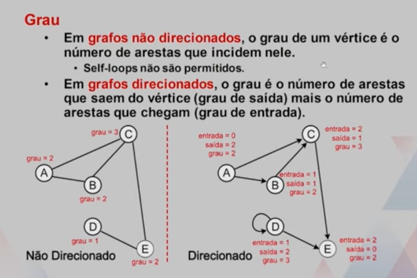
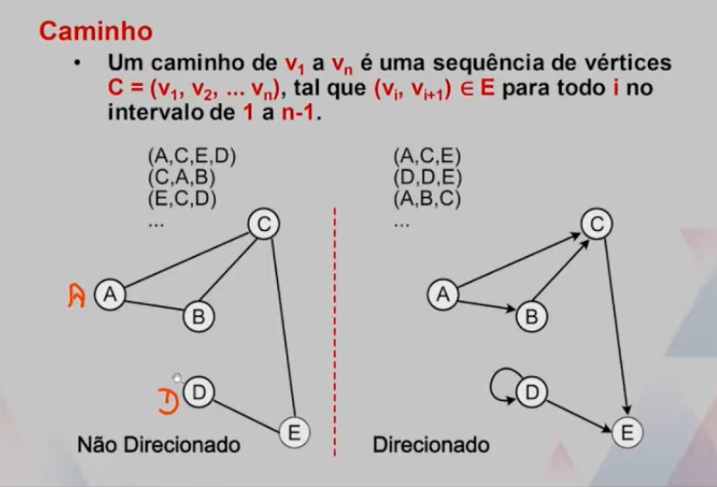
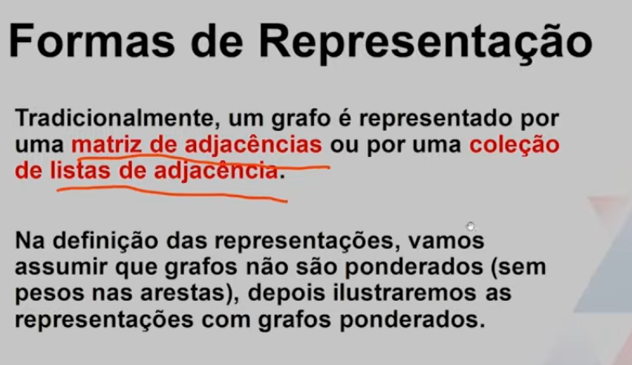
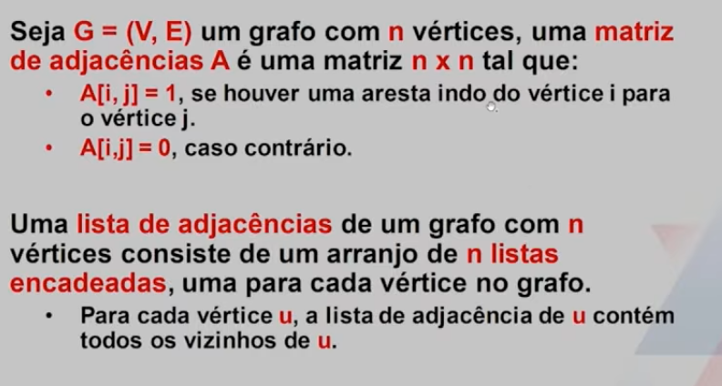
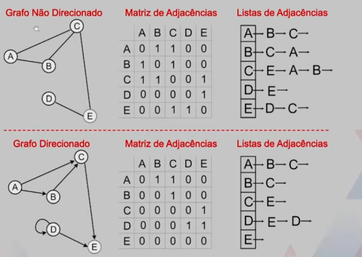
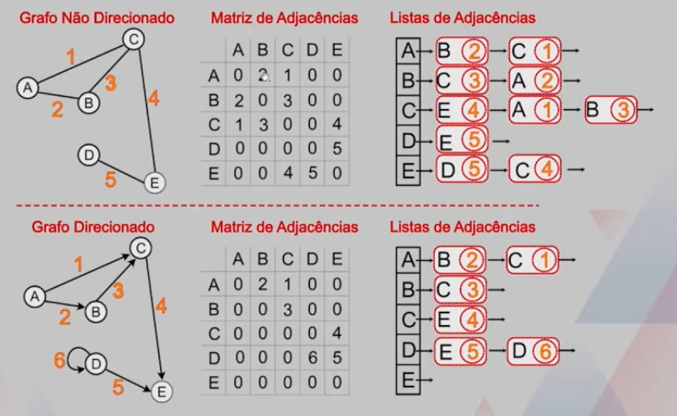
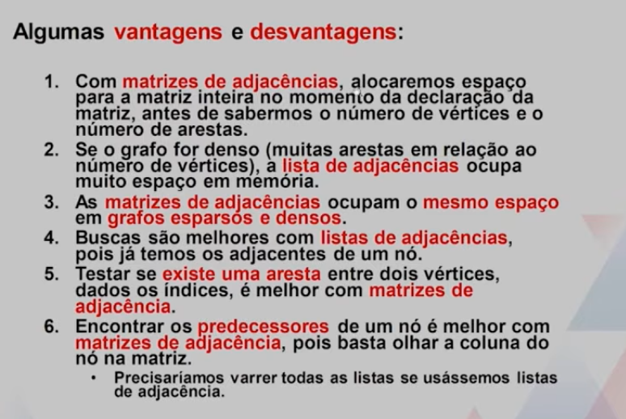

# Grafor

## Conceitos Básicos

Um Grafo **G = (V, E) é uma estrutura formada por um conjunto V = {v1, v2, ... vn} de vértices e um conjunto E = {e1, e2, ... em} de arestas, onde cada aresta é um par de vértices.
-   Um grafo é dito não direcionado se as relações representadas pelas arestas não tem um sentido, ou seja, arestas podem ser seguidas em qualquer direção: e(i) = (vj, vk), onde vj, vk ∈ V.
-   Um grafo é dito direcionado se as arestas são pares ordenados de vértices, indo de um em direção ao outro: ei = (vj, vk), onde vj, vk ∈ V.

## Grau

## Caminho 

## Formas de representação

## Vatagens e desvantagens
