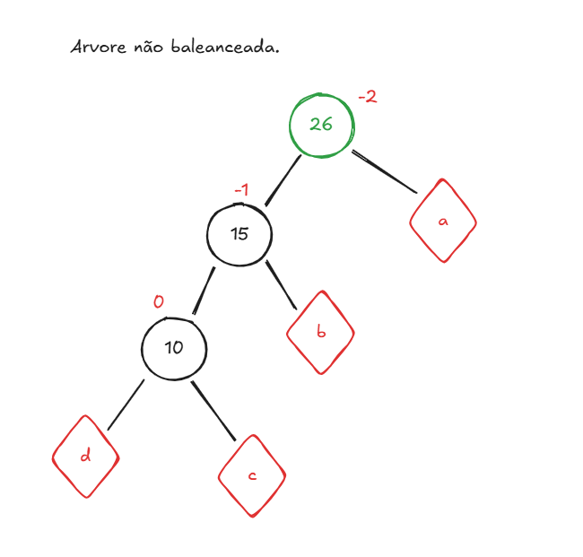

# Anotações semana 6 (arvores AVL)

## O que é uma arvore desbalanceada. 

Quando o nó está com +2 ou -2, ele é considerado um nó desbalanceado. A arvore deve ficar no intervalo de -1 a 1 para que seja uma arvore balanceada. 
-   Um nó sem filhos ou com um filha a direita e um filho a esquerda, é um nó balanceado e portante tela valor 0.



## Rotação e regras para uso das rotações


## Exemplos de rotação


Os arquivos desta pasta podem ser compilados com:
````
$ g++ *.cpp
````
Feito isso, a execução será feita com:
````
$ ./a.out
````