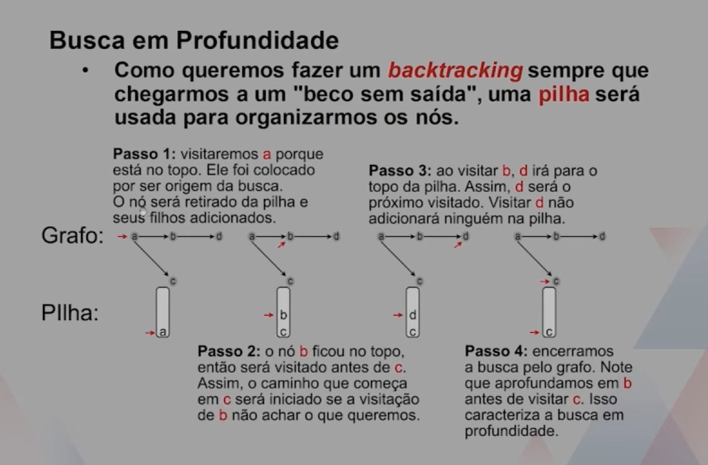
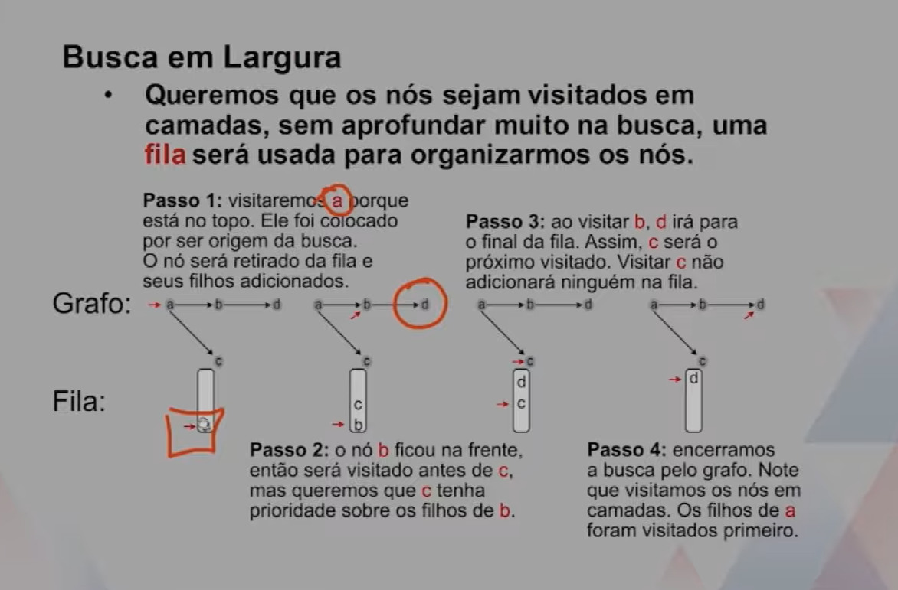
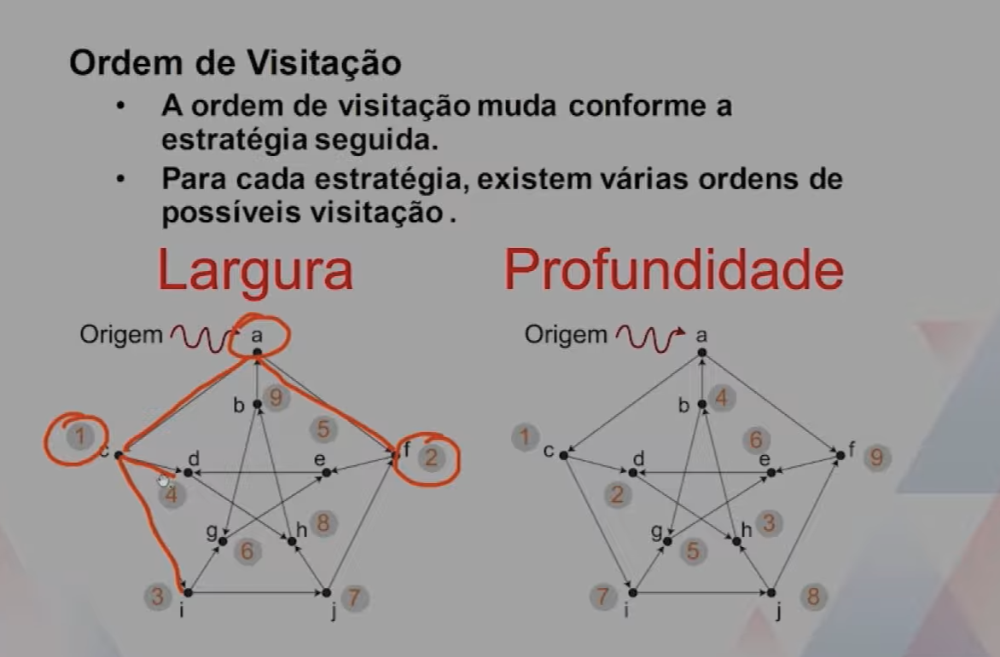
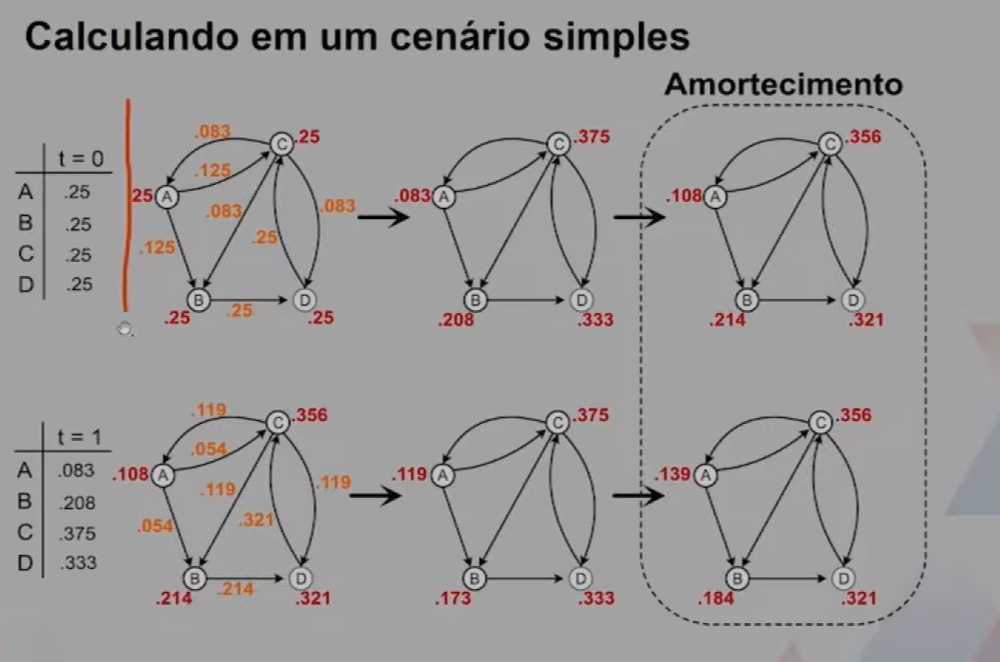

# Grafos

 
 ## Motivação
 Algoritimos para problemas diversos muitas vezes recaem em algum tipo de visitação sobre os vertices.

 Entender como isso pode ser feito de maneira sistemática ajuda a evitar loops infinitos.

## Busca em profundidade
-   A estratégia consiste em se aprofundar no grafo sempre que possivel. 
-   Se estamos em um ponto do grafo e ainda há um caminho não percorrido, seguimos esse caminho. 
-   Se estamos em um ponto do grafo e já percorremos tudo ao redor, voltamos para o vértice anterior(backtraking) procurando caminhois não explorados
-   A busca acaba quando:
    1. Encontramos o que queríamos.
    2. Visitamos todos os vértices e não achamos nada.

-    Seguimos intuitivamente a busca em profundidades quando entramos em um labirinto.

## Busca em largura
-   A estratégia consiste em explorar sem se afastar tanto do ponto inicial.
-   Primeiram3ente, seguimos o caminho proximo da origem, se não acharmoso que queríamos, voltamos para o início e tentamos outro caminho.
-   Ao achar o que queriamos, garantimos que sabemos uma maneira rápida de se chegar até lá.
-   Em geral, só verificamos vétices a uma distancia de k+1 se todos os vértices de distância K já tiverem sido visitados.

## Ordem de visitação

## PageRank

Cada link que uma página **p** recebe de outras páginas é um ***voto de suportre***, sendo esse voto utilizado para computar o PageRank.
1. Receber links aumenta a autoridade da pagina. EM outras palavras, existem muitas outras páginas recomndando paginas para seus usuários.

Receber links de páginas com **PageRank alto** é melhor do que links de páginas com PageRank baixo. 

2. O **voto de suporte** de links vindos de páginas com PageRank alto é mais valioso, dado que elas possuem mais autoridade. É o que entendemos por links de qualidade.

Páginas que possuem **muitos links** poara outras páginas fornecem um **peso menor** do que páginas com poucos links. 

3. Uma página que recomenda demais deve ser levada menos em conta do que páginas que recomendam menos. 
O peso do seu voto de suporte é distribuído entre as páginas que ela recomenda. 

## Considerações sobre o modelo

-   Links de uma página para si mesma serão ignorados. Isso faz com que o grafo que representará as páginas web não tenha self-loops.
-   múltiplos  links de uma página para outra serão tratados como apenas um link.
-   Os PageRanks transferidos de uma página para outra, em cada iteração, são igualmente distribuidos entre todos os links de saida.
-   Asssumiremos que nao existem páginas sem links, pois isso impediria que o pageRank da página fosse distribuído.

## Interpretação dos valores. 

-    Os PageRanks são uma distribuição de probabilidade. Note que em todas as iterações a soma dos valores resulta em 1 (um)
-   Uma interpretação dos valores seria que queremos entender onde chegaria alguém que navega na internet, clicando em links ao acaso. 

## Problemas com o modelo simplificado
-   Páginas sem links de saída tendem a drenar os PageRanks da rede. 

-   Páginas que formam um ciclo, sem conexão com as outras páginas, tendem a bloquear PageRanks dentro do ciclo e ficar em looping infinito. 

## exemplos
